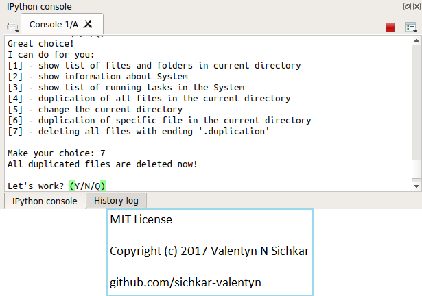

# While loop and lists in Python
Working with while loop and lists in Python

### Reference to:
[1] Valentyn N Sichkar. Working with while loop and lists in Python // GitHub platform [Electronic resource]. URL: https://github.com/sichkar-valentyn/While_loop_and_lists_in_Python (date of access: XX.XX.XXXX)

## Description
Using Spyder as IDE for Python here is the program which shows how to use _while_ loop and _lists_.
Program implements the duplicating files in the directory and deleting files with extensions 'duplication'. 

## While loop and lists in Python

## MIT License
## Copyright (c) 2017 Valentyn N Sichkar
## github.com/sichkar-valentyn
### Reference to:
[1] Valentyn N Sichkar. Working with while loop and lists in Python // GitHub platform [Electronic resource]. URL: https://github.com/sichkar-valentyn/While_loop_and_lists_in_Python (date of access: XX.XX.XXXX)
